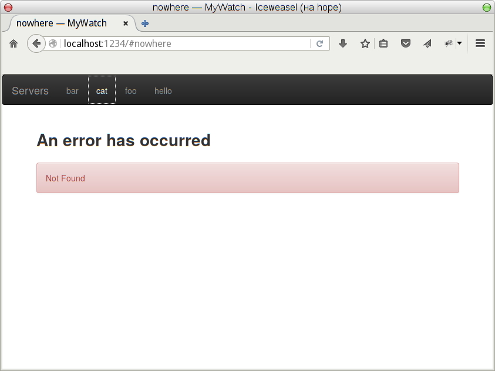

My Watch
========

Web application for viewing and killing MySQL queries on multiple
servers. Designed to work behind [Sproxy](https://github.com/zalora/sproxy).


Requirements
============

MyWatch is written in Haskell with [GHC](http://www.haskell.org/ghc/).
All required Haskell libraries are listed in [mywatch.cabal](mywatch.cabal).
Use [cabal-install](http://www.haskell.org/haskellwiki/Cabal-Install)
to fetch and build all pre-requisites automatically.


Installation
============

    $ git clone https://github.com/zalora/mywatch.git
    $ cd mywatch
    $ cabal install


Usage
=====

Type `mywatch --help` to see usage summary:

    Usage:
      mywatch [options] MYCNF

    Options:

      -d, --datadir=DIR        Data directory including static files [default: {cabal data dir}]

      -s, --socket=SOCK        Listen on this UNIX-socket [default: /tmp/mywatch.sock]
      -p, --port=PORT          Instead of UNIX-socket, listen on this TCP port (localhost)

      -h, --help               Show this message


Configuration
=============

The `MYCNF` argument denotes a MySQL client config file.  Each section in this
file describes a MySQL server where you can view processes. As usually, the
"client" section applies internally to all other sections, but is ignored by
MyWatch. Remember to make this file secret if it includes passwords, or use the
`!include` directive. However, MyWatch does not parse included files for
more sections.

```
[foo]
host = example.com
user = user1
...

[bar]
host = example.net
user = user2
...

!include /run/keys/my.secret.cnf
```

Sproxy Configuration
====================

* To access the service allow `GET` for `/`, `/static/%` and `/severlist.json`.
* To see processes on a particular MySQL server allow `GET` and `HEAD` for
  `/server/:server/processlist.json`.
* To kill processes allow `DELETE` for `/server/:server/process/%`


Database Configuration
======================

MyWatch needs the [PROCESS](http://dev.mysql.com/doc/refman/en/privileges-provided.html#priv_process)
privilege.

To be able to kill queries a procedure named `mywatch_kill` must exist
in the `mysql` database.  MyWatch invokes `CALL mysql.mywatch_kill(id)`
for killing queries.  It's up to you how to implement this routine, for a
safe example see [sql/mywatch_kill.sql](sql/mywatch_kill.sql). Of cource,
MyWatch should be granted to execute this procedure.  If this procedure
does not exist, MyWatch will not show this possibility in user interface,
API will work, but result in Internal Server Error (HTTP 500). There is no
filtering at application level, though the "kill" button may not be shown
in some circumstances.


Screenshots
===========



